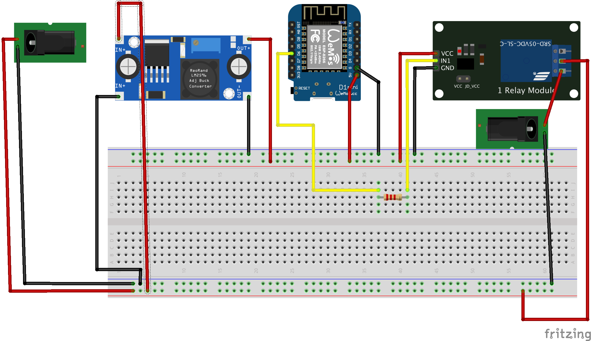

# LED strip wireless controller
## Design Goals
- inexpensive (don't like to say cheap :) )
- readily available parts
- low power consumption when idle
- reliable, this will be powered on 24x7
- MQTT controllable, I use Home Assistant for my home automation needs
- easy upgradable firmware. Sonoff-Tasmota is brilliant for this, very active project, supports OTA updates.

## Shopping list, bill of materials
- wemos d1 mini board, [Aliexpress](https://www.aliexpress.com/item/D1-mini-Mini-NodeMcu-4M-bytes-Lua-WIFI-Internet-of-Things-development-board-based-ESP8266-by/32631693796.html?spm=2114.search0104.3.2.6e7b4f8dfdnbvQ&ws_ab_test=searchweb0_0,searchweb201602_9_10065_10068_319_10059_10884_317_10887_10696_321_322_10084_453_10083_454_10103_10618_10304_10307_10820_10821_537_10302_536,searchweb201603_80,ppcSwitch_0&algo_expid=1861050a-e1ad-4a70-8436-a3a60d32f714-0&algo_pvid=1861050a-e1ad-4a70-8436-a3a60d32f714&transAbTest=ae803_4), € 1,81
- 12V step down/buck convertor to 5V, [Aliexpress](https://www.aliexpress.com/item/1PCS-High-Quality-3A-Adjustable-DCDC-LM2596-LM2596S-input-4V-35V-Output-1-23V-30V-dc/32280431843.html?spm=2114.search0104.3.1.1a8b7cacRg8bMc&ws_ab_test=searchweb0_0,searchweb201602_9_10065_10068_319_10059_10884_317_10887_10696_321_322_10084_453_10083_454_10103_10618_10304_10307_10820_10821_537_10302_536,searchweb201603_80,ppcSwitch_0&algo_expid=9a5396ae-bf58-4f48-870a-80717f2fafc6-0&algo_pvid=9a5396ae-bf58-4f48-870a-80717f2fafc6&transAbTest=ae803_4), € 0,55
- 12V/3A power supply, [Aliexpress](https://www.aliexpress.com/item/DC12V3A-Power-Adapter-for-Led-Strip-DC12V36W-Voltage-Transfomer-with-UK-Plug-Power-Supply-Led-Driver/32815451511.html?spm=2114.search0104.3.14.3124317dHrr3Ji&ws_ab_test=searchweb0_0,searchweb201602_9_10065_10068_319_10059_10884_317_10887_10696_321_322_10084_453_10083_454_10103_10618_10304_10307_10820_10821_537_10302_536,searchweb201603_80,ppcSwitch_0&algo_expid=6a58a83f-3606-464d-81c6-f886531599b0-2&algo_pvid=6a58a83f-3606-464d-81c6-f886531599b0&transAbTest=ae803_4), € 6,50
- 2x Female Barrel Power jack, [Aliexpress](https://www.aliexpress.com/item/5-PCS-Lot-Power-Plug-Adaptors-Pigtail-Female-Barrel-Jack-Wire-Cable-5-5mm-x-2/32904315691.html?spm=2114.search0104.3.156.481c609e7mFPJr&ws_ab_test=searchweb0_0,searchweb201602_9_10065_10068_319_10059_10884_317_10887_10696_321_322_10084_453_10083_454_10103_10618_10304_10307_10820_10821_537_10302_536,searchweb201603_80,ppcSwitch_0&algo_expid=37d5a2b8-4379-4891-827b-75b46672e7a3-22&algo_pvid=37d5a2b8-4379-4891-827b-75b46672e7a3&transAbTest=ae803_4), € 3,16 for a pack of five
- 2.2K resistor, [Aliexpress](https://www.aliexpress.com/item/New-300pcs-1-4W-1-Metal-film-resistor-510-560-1K-1-1K-1-2K-ohm/32821605455.html?spm=2114.search0104.3.8.7b0e4b84uLAdo8&ws_ab_test=searchweb0_0,searchweb201602_9_10065_10068_319_10059_10884_317_10887_10696_321_322_10084_453_10083_454_10103_10618_10304_10307_10820_10821_537_10302_536,searchweb201603_80,ppcSwitch_0&algo_expid=58aaaa6b-7571-4ac8-ab41-2110da4f70e3-1&algo_pvid=58aaaa6b-7571-4ac8-ab41-2110da4f70e3&transAbTest=ae803_4), € 0,51 for a pack of 100. Probably better to get a mixed pack of resistors as it may be more useful to have a variety of values rather then 100 pcs of the same value.
- relay board, [Aliexpress](https://www.aliexpress.com/item/with-optical-coupler-1-way-relay-module-relay-expansion-board-high-and-low-level-trigger-all/32810054219.html?spm=2114.search0104.3.8.7f6475febj21aD&ws_ab_test=searchweb0_0,searchweb201602_9_10065_10068_319_10059_10884_317_10887_10696_321_322_10084_453_10083_454_10103_10618_10304_10307_10820_10821_537_10302_536,searchweb201603_80,ppcSwitch_0&algo_expid=90567901-fe45-484e-a215-4ade06886cad-1&algo_pvid=90567901-fe45-484e-a215-4ade06886cad&transAbTest=ae803_4), € 1,97
- some prototype board to place components on, not necessarily required but keeps things tidy. You may buy a bunch for € 1.15 on [Aliexpress](https://www.aliexpress.com/item/86036-Free-shipping-10pcs-Double-Side-Prototype-PCB-diy-Universal-Printed-Circuit-Board-4x6cm/32656277833.html?spm=2114.search0104.3.8.53967877uHoaB0&ws_ab_test=searchweb0_0,searchweb201602_9_10065_10068_319_10059_10884_317_10887_10696_321_322_10084_453_10083_454_10103_10618_10304_10307_10820_10821_537_10302_536,searchweb201603_80,ppcSwitch_0&algo_expid=e080477f-abf9-488f-a106-1877b4097355-1&algo_pvid=e080477f-abf9-488f-a106-1877b4097355&transAbTest=ae803_4)
- project box, to pack things neatly, had one lying around from another project, but you can get one on [Aliexpress](https://www.aliexpress.com/item/100x60x25mm-Waterproof-Black-DIY-Housing-Instrument-Case-Plastic-Electronic-Project-Box-Electric-Supplies/32952374406.html?spm=2114.search0104.3.1.6a6d6c09HmJx70&ws_ab_test=searchweb0_0,searchweb201602_9_10065_10068_319_10059_10884_317_10887_10696_321_322_10084_453_10083_454_10103_10618_10304_10307_10820_10821_537_10302_536,searchweb201603_80,ppcSwitch_0&algo_expid=e4a25903-b728-4dbb-816b-787c5d968988-0&algo_pvid=e4a25903-b728-4dbb-816b-787c5d968988&transAbTest=ae803_4), € 1,17. Check for size as you need to fit all the boards plus wires. 
- some wire, always have a good stock of wires around the place so it didn't cost me a penny. 
## Tools
- soldering iron, you can get away without one if you're using prototyping wire, but I went for soldering as wanted to make this as reliable as possible.
- wire clippers, screwdrivers, 
- solder
- laptop for programming the board (goes without saying you have one handy, since I hope you're not reading this page on paper :) )
- software for the initial firmware upload to the wemos board. I personally use [Esptool](https://github.com/arendst/Sonoff-Tasmota/wiki/Esptool) or [VSCode](https://code.visualstudio.com/) with the [PlatformIO plugin](https://docs.platformio.org/en/latest/ide/vscode.html). You can also use Arduino IDE 
##Schematic
Fritzing schematic can be downloaded and edited in this repo [Friting schematic](schematic/led-strip-wireless-controller.fzz)

## Schematic

